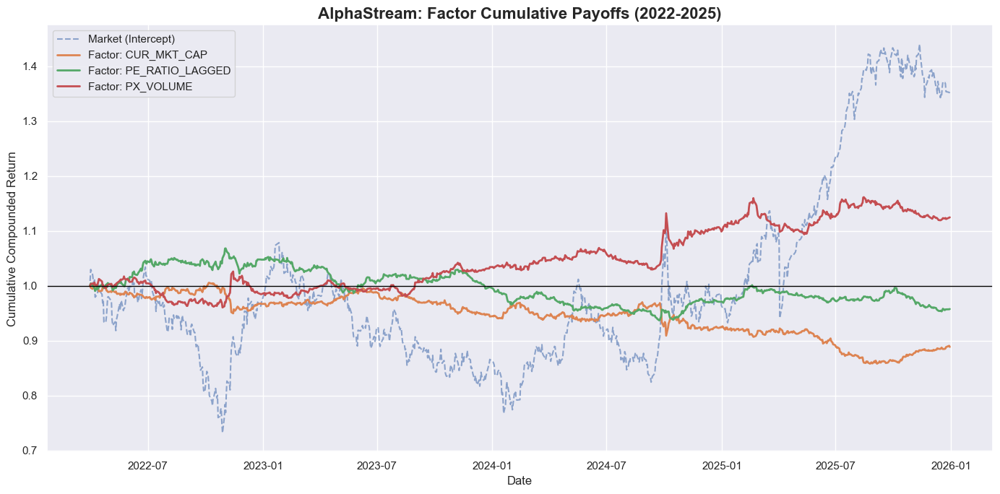
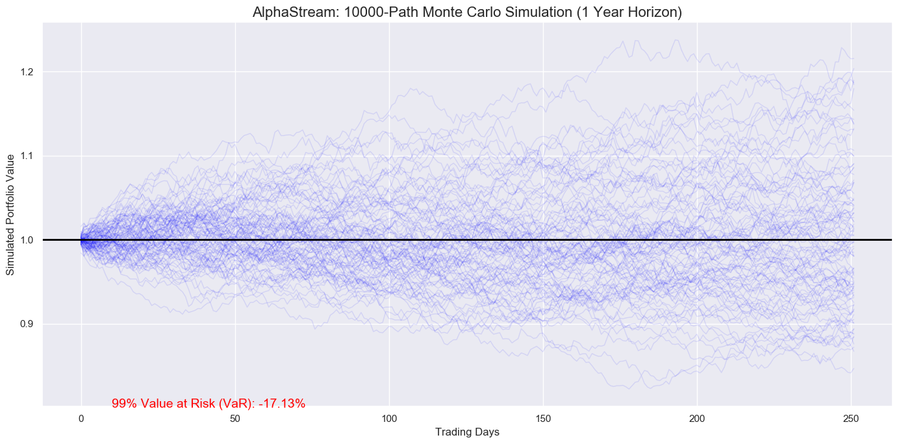
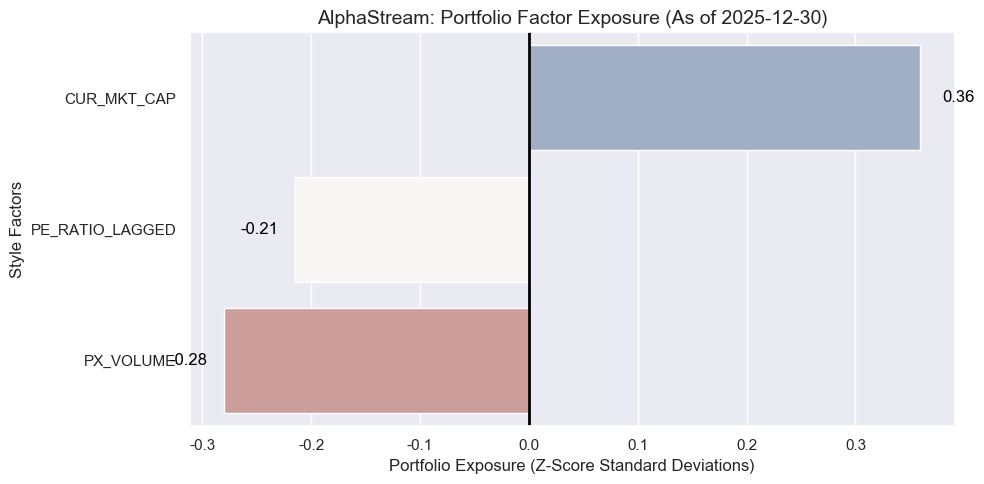

# AlphaStream

HK Equity Multi-Factor Risk Model & Min-Variance Portfolio Optimization

## Pipeline

```
Raw Data → Feature Eng → Factor Model → Optimization → Risk Mgmt → Report
   ↓           ↓              ↓              ↓*             ↓           ↓
 Parquet   Winsor/Std    OLS Daily      Markowitz    Monte Carlo   Excel/Email
```

\* Optimization module (SLSQP solver) — **AI-assisted, under active research**

---

## Core Components

### 1. Data & Feature Engineering
- Load HK market data (~440k rows): price, mkt cap, PE, volume
- Cross-sectional winsorization (2.5%/97.5%) + z-score standardization

### 2. Factor Model
Daily cross-sectional regression:
```
Return_T1 = α + β₁·MKT_CAP + β₂·PE_LAGGED + β₃·VOLUME + ε
```
Outputs: factor returns matrix + idiosyncratic alpha residuals



### 3. Portfolio Optimization ⚠️
> **AI-generated code** — I'm refactoring this section with deeper mathematical understanding.

- Minimize portfolio variance: `min wᵀΣw`
- Constraints: Σw=1, 0≤w≤30%, long-only
- Current result: 7.27% annualized idiosyncratic volatility





---

## Web Service & Automation ⚠️

> **RESTful API + Email automation** — AI-generated scaffolding.

### FastAPI Backend (`Src/app.py`)
- `POST /trigger` — Async pipeline execution
- Returns `job_id` immediately, runs optimization in background

### Web Console
Simple HTML interface for non-technical users:
- Input investor email
- Trigger pipeline with one click
- Auto-generates & sends report

### Automated Email (`Src/report_automator.py`)
- Generates Excel tear sheet with optimal weights
- Embeds portfolio chart (Base64 inline)
- Sends via Gmail SMTP with attachment


---

## Project Structure

```
AlphaStream/
├── Data/               # Raw & processed parquet files
├── Notebooks/          # Research notebook (factor model core)
├── Src/
│   ├── app.py          # FastAPI server (⚠️ AI)
│   ├── report_automator.py  # Excel + email (⚠️ AI)
│   └── templates/      # Web UI
└── images/             # Charts for README
```

## Run

```bash
# Jupyter research
jupyter notebook Notebooks/alpha_stream_v1.ipynb

# Web service
python Src/app.py   # http://localhost:8080
```

## Status

| Module | Status |
|--------|--------|
| Data pipeline | ✅ Hand-written |
| Factor model | ✅ Hand-written |
| Optimization | ⚠️ AI-assisted, refactoring |
| REST API | ⚠️ AI-generated |
| Email automation | ⚠️ AI-generated |

---

## 📚 配套文档（学习 & 完善指南）

> 以下三份文档是**外部评审 + 教学视角**的补充材料（不是原作者的内容），按「先懂是什么 → 再学怎么学 → 最后怎么改」的顺序阅读最佳。

| 文档 | 用途 | 面向谁 |
|---|---|---|
| **[QUANT_RESEARCH_GUIDE.md](QUANT_RESEARCH_GUIDE.md)** | Quant Research 的**九阶段工作流程 + 四梯队学习路线 + 知识地图**（含"会不会用到随机过程/时间序列"的明确回答） | 想系统入门量化的你 |
| **[OPTIMIZATION_PLAN.md](OPTIMIZATION_PLAN.md)** | 把项目从"原型"补成"研究级"的**详细落地执行清单**，分 P0（让结论可信）→ P1（真风险模型）→ P2（工程交付），每项锚定到真实代码行 | 准备动手完善的你（quant researcher 视角） |
| **[WEB_ARCHITECTURE_SOP.md](WEB_ARCHITECTURE_SOP.md)** | 一般软件**前后端交互的通用范式 + 可勾选 SOP**，含内联请求-响应流程图 | 想弄清"网页和后端怎么对话"的你 |

**推荐阅读路径**

```
1. 先读 QUANT_RESEARCH_GUIDE.md  → 建立"量化研究长什么样"的全景
2. 再看本 README 的 Pipeline / Status → 对照"AlphaStream 现在卡在哪"
3. 想动手 → 打开 OPTIMIZATION_PLAN.md 按 P0→P2 顺序改
4. 疑惑"前端怎么触发后端" → 翻 WEB_ARCHITECTURE_SOP.md
```

**一句话现状**：AlphaStream 是"会跑、架构对、但结论不可信"的教育级原型。三份文档分别回答**学什么 / 怎么改 / 怎么连**，配合原 README 即可完整上手。
